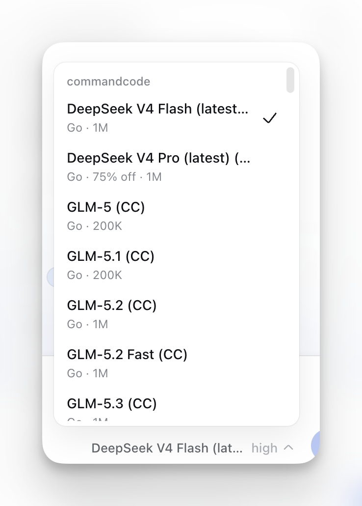
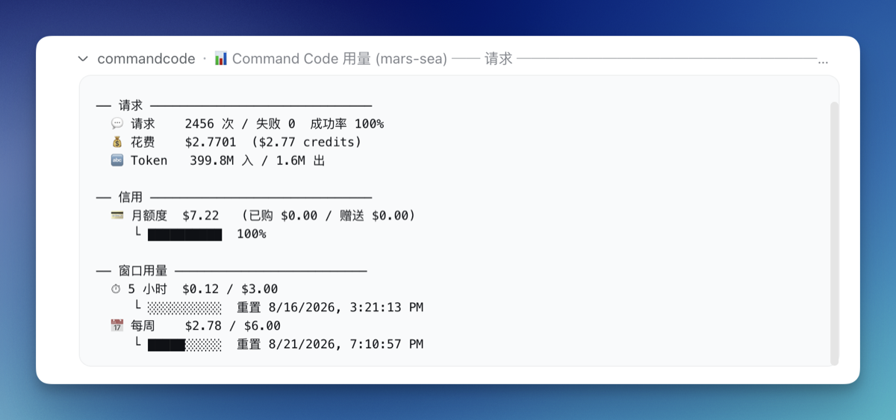
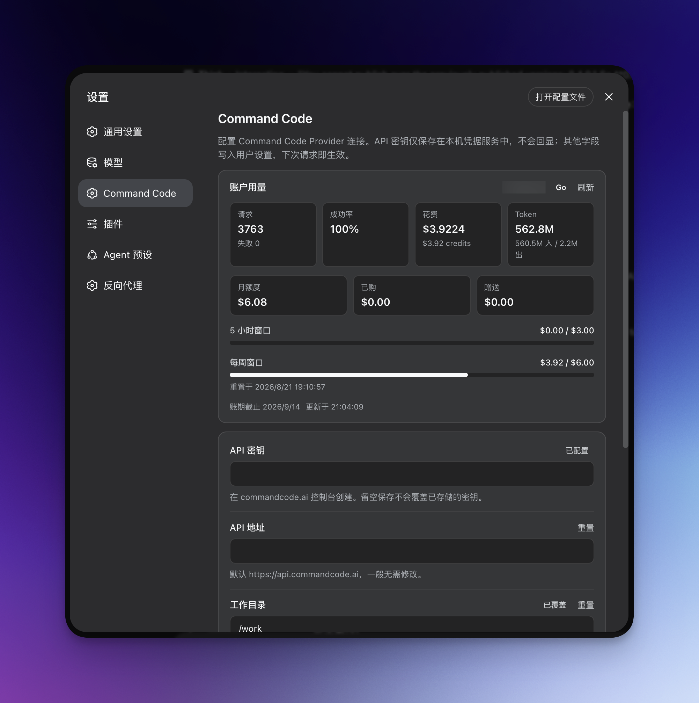

# dsh-commandcode-provider

[English](./README.md) | **简体中文**

[](https://github.com/awesome-dsh-plugin/awesome-dsh-plugin)
[](https://github.com/Mars-Sea/dsh-commandcode-provider/stargazers)
[](https://github.com/deepseek-ai/deepseek-harness)
[](https://github.com/Mars-Sea/dsh-commandcode-provider/pulls)
[](https://github.com/Mars-Sea/dsh-commandcode-provider/actions/workflows/ci.yml)
[](https://opensource.org/licenses/MIT)
[](https://www.npmjs.com/package/@mars-sea/dsh-commandcode-provider)

非官方 [DeepSeek Harness](https://deepseek-harness.github.io/deepseek-harness/) 的 LLM provider 插件，用于 **Command Code**，移植自 [pi-commandcode-provider](https://github.com/patlux/pi-commandcode-provider)（MIT 协议）。

> 这是一个社区集成。你需要自己的 Command Code 账号、API key 或订阅，并遵守 Command Code 的服务条款。本项目与 Command Code, Inc. 无关。

## 功能一览

- **插件包**：一条 `dsh plugin add` 命令安装到任意 dsh 配置，注册 `commandcode` provider 路由，带实时模型目录。
- **专属设置页**：API key 输入、连接参数、实时「账户用量」卡片和「隐藏套餐外模型」开关。
- **多账户轮换**：一个账户用量打满后，请求自动切换到下一个账户。详见[多账户轮换](#多账户轮换)。
- **key 配置灵活**：设置页填写、环境变量或官方 CLI 登录文件均可。
- **模型选择器标注**：每个模型标注最低套餐、折扣/FREE 徽章、峰谷时段、图片支持与上下文长度，免费模型置顶。
- **按套餐过滤**：默认隐藏超出订阅套餐的模型，可一键关闭。
- **推理强度支持**：支持推理强度的模型可在选择器中选择档位。
- **图片输入**：Vision 模型支持发送图片。

## 安装

```sh
dsh plugin --profile web add @mars-sea/dsh-commandcode-provider@latest
```

## 更新

```sh
dsh plugin --profile web add @mars-sea/dsh-commandcode-provider@latest
```

然后重启 Web 应用。

## 获取 API key

最简单的途径是官方 CLI（Node.js 22+）：

```sh
npm i -g command-code@latest
cmd login        # macOS/Linux；Windows 原生版：cmdc login
```

也可以在 [Keys 设置页](https://commandcode.ai/mars-sea/settings/keys) 创建 key 后粘贴到 **设置 → Command Code**，或 `export COMMANDCODE_API_KEY="user_..."`。

## 验证是否生效

重启后，在 **设置 → Command Code** 填入 API key 并保存；**设置 → Models** 出现 **Command Code** 卡片，模型选择器在 **commandcode** 下列出实时目录。选择套餐内包含的模型发送消息即可。

## 用量面板

插件注册了 `/commandcode` 斜杠命令，显示各账户的用量状态：

```text
/commandcode        （或 /commandcode status）
```

## 多账户轮换

有多个 Command Code 订阅时，插件可以在一个账户达到用量限额后**自动切换到下一个账户**：

- **配置**：在 **设置 → Command Code** 的「多账户轮换」卡片添加账户并填写备注名与 API key；顶层 key 始终是第一顺位的 `default` 账户。
- **手动切换**：卡片上的「当前使用账户」下拉框可指定优先账户；所选账户耗尽时自动回落到其他账户，窗口重置后自动恢复。
- **状态展示**：「账户用量」卡片与 `/commandcode` 均按账户分别显示状态。

等价的 YAML（`$DSH_HOME/settings.yaml` 或组合配置）：

```yaml
llm-commandcode:
  apiKeyEnv: COMMANDCODE_API_KEY        # 第一顺位（default）账户
  activeAccount: COMMANDCODE_API_KEY_2   # 可选：手动指定当前账户（default 或某账户的凭据引用）
  accounts:                              # 之后的轮换顺序
    - label: Go #2
      apiKeyEnv: COMMANDCODE_API_KEY_2
    - label: Go #3
      apiKeyEnv: COMMANDCODE_API_KEY_3
```

## 配置

**设置 → Command Code** 可配置 API key、API 地址、工作目录与请求/流超时；配置好 key 后，页面顶部会显示实时「账户用量」卡片。

同一组选项也位于 `$DSH_HOME/settings.yaml`（修改即刻生效，无需重启）：

```yaml
llm-commandcode:
  apiKeyEnv: COMMANDCODE_API_KEY   # 凭据引用
  apiBase: https://api.commandcode.ai
  workingDir: /path/to/project     # 可选
  modelsCachePath: ~/.commandcode/models-cache.json
  requestTimeoutMs: 60000          # 默认 60s
  streamIdleTimeoutMs: 300000      # 默认 300s
```

## 注意事项与限制

- **图片输入按模型能力限制**：仅 Vision 模型接受图片，纯文本模型会直接拒绝。
- 含图片的会话切换到纯文本模型会被 dsh 拒绝——请改选带 *`Image`* 标记的模型，或先移除图片。
- **不支持 `stop` 序列**：携带它的请求会报错。
- 推理块不会重放到后续轮次；只有带配对工具结果的工具调用会被重放。
- 模型目录无需 key 即可浏览；对话请求需要 key。

## 权限与隐私

本插件只在本地与你的 Command Code 账号之间通信：本地仅读写凭据存储与模型缓存文件（兜底读取 `~/.commandcode/auth.json`）；网络仅访问 Command Code API。无遥测。

## 关闭 / 卸载

- **禁用**（不删除）：编辑你 profile 的 `cordis.patch.yml`，注释掉（或移除）`llm-commandcode` 行，或设置 `disabled: true`，然后重启。
- **完全卸载**：

  ```sh
  dsh plugin --profile web remove @mars-sea/dsh-commandcode-provider
  ```

  你在 dsh 凭据库和 `~/.commandcode/auth.json` 中的 API key 不会被改动。

## 开发

```sh
npm install
npm run typecheck   # tsc --noEmit
npm run build       # tsdown -> lib/
```

在 profile 里试用本地构建：

```sh
dsh plugin --profile web add /path/to/dsh-commandcode-provider
```

修改 `src/` 后需重新运行 `npm run build` 并重启应用。

## 社区与反馈

-  [GitHub 仓库](https://github.com/Mars-Sea/dsh-commandcode-provider)
-  [GitHub Releases](https://github.com/Mars-Sea/dsh-commandcode-provider/releases)
-  [npm 包](https://www.npmjs.com/package/@mars-sea/dsh-commandcode-provider)
-  [Linux.do 社区](https://linux.do/)

## 许可证

MIT —— 见 [LICENSE](./LICENSE)。部分内容移植自 [pi-commandcode-provider](https://github.com/patlux/pi-commandcode-provider)（MIT）。

## 界面截图

**模型选择器** —— 套餐档位、折扣/FREE、峰谷时段、Image 与上下文标注：



**用量面板** —— `/commandcode` 的分账户报告：



**设置页** —— API 密钥、连接参数、多账户轮换与实时账户用量卡片：


